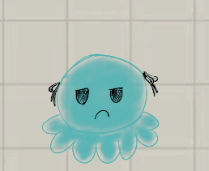
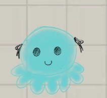
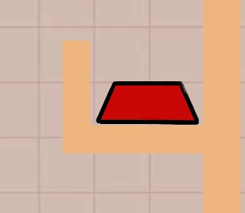

# Egaku / 画 GDD

# 游戏介绍

画く为双人合作平台跳跃游戏，一名玩家作为闯关者操控小人来抵达终点，另一名玩家作为画手用在屏幕上作画的方式来为闯关者生成平台来帮助闯关者过关。

# 玩法

## 胜利方式

闯关者成功抵达终点，进入下一关。

## 玩家1（闯关者）

操控小人到达终点，输入包括：左右移动（AD） / 跳（空格） / 场景互动键 （目前为Shift进行抓取轻物体， E为对电线进行交互）

闯关者玩家的鼠标位置会同时显示在画手玩家的屏幕上方便进行交流，目前以小绿色三角形作为暂时的显示，并且拥有拖尾

### 屏幕可见

- 所有平台
- 画手正在画&已生成的平台
- 自己

## 死亡

闯关者“死亡”时会被传送回出生点/最近存档点，处罚死亡的条件有以下

- 掉出地图边界
- 落水
- 被墨水炮弹击中

## 玩家2（画手）

利用鼠标画一笔画来生成平台，可以对选择不同画笔（参考画手画笔材质part）以及使用橡皮擦（点一下删掉点到的已生成平台， 或是划过去一次清除多个画出来的平台）。

画的东西在还没松手时都不会有实体生成，但是玩家可以看到画的路径。

画手每关会分配不同的墨水量，在画画途中会消耗一定墨水。墨水量会在画手的右边以条状UI + 数字显示（例如：30/50）

- 在画出来的东西落处地图区域后会自动删除并且返还墨水量

笔画在画的途中碰到以下情况会强制结束画画并生成：

- 地图平台
- 禁画区域
- 墨水量耗尽

### 屏幕可见

- 摄像机跟随闯关者
- 所有平台
- 正在画&画出的东西
- 画板UI

### 画手画笔材质

- 木头 （棕色）
    - 有重力，有碰撞
    - 轻物体
    - 闯关者可推动与抓取
    - 可以在水上漂浮
    - 可被云弹起
- 铁（灰色）
    - 重物体
    - 有重力，有碰撞
    - 会沉入水中
    - 可压在按钮上
    - 击碎易碎品（玻璃/云）
- 云（白色）
    - 无重力，在空中上下飘动，有碰撞
    - 物体碰到上面会弹起来，但是会被重物击碎
    - 闯关者站在上面会高跳
- 电线（黄色）
    - 无重力，无碰撞
    - 画出路径，路径的两端（以下称为起始点）可以被交互，闯关者交互（E）其中一端后会沿着路径跑跑到另一端 （参考马里奥奥德赛电线），可以穿过任何地形。
    - 交互点必须要在电池的电场范围内才能进行交互，在沿着路径跑的途中离开电池范围会在离开的范围内停止travel并掉下来。
    - 闯关者手上抓的东西也会跟着电线一起Travel。
        - 抓住电池进行Travel时就必定可以Travel，因为电场约等于跟着玩家一起跑了
        - Travel时玩家松开抓取键则会丢下东西
    - 电池 - 场景物件
        - 轻物品 - 可以被玩家抓取
        - 每个电池会有自己的电场大小
- 橡皮擦
    - 划过去的所有画出来的东西都会被删除掉，并且返还墨水量

# 场景物件 / 区域

## 章鱼怪物

一种怪物，在玩家离他距离远的时候会发射墨水炮弹，但玩家接近时会变成善良形态，停止发射

玩家被炮弹击中后会被强制返回出生点/存档点

有些章鱼会朝着固定方向发射，有些则会瞄准玩家后发射

其炮弹可以摧毁易碎物品，如玻璃（打两下），木头

炮弹碰到云同样会反弹，但不会摧毁云

## 玻璃

会挡住玩家，可以被重物/墨水炮弹所击破

## 水

玩家落进去会溺死

轻物品可以漂浮在上面

玩家可以站在轻物品上然后抓取渡河

## 电池

每个电池可以自由设置电场大小

轻物体，可以被抓取

电线相关规则请参考画笔的电线部分

## 电闸

由电池槽和闸门组成

- 电池槽没有碰撞体，不会挡住玩家
- 电池槽为放置电池的地方，当电池在附近时会自动被吸附进电池槽中
    - 电池被吸附进去后也会关闭碰撞
    - 装进电池槽后玩家依旧可以使用抓取将其抓出来
- 电池槽被放入电池后将会通电，对应的机关就会被打开，例如铁门向上升起
    - 拿出后将会没电，机关复位，例如铁门关上

## 禁画区域 （红色）

画手无法在此区域画画

无法在区域内开始画

在外面画的笔画在碰到禁画区域后就会立马结束绘画

## 按钮

需要被玩家踩上/指定材质物体按下才能触发的机关，一旦触发就会一直触发

按压要求会使用标记图表放在按钮上，例如带着眼睛的方块代表玩家，铅笔代表要是用木头材质按下

## 画笔

闯关者碰到之后会解锁画手的对应种类笔

# 玩家操作

## 闯关者

- AD 进行左右移动
- 空格键进行跳跃
- 左Shift抓取
- E对电线进行交互

画手

- Tab 开关笔盒UI
- 鼠标滚轮快速切换画笔
- 按住鼠标左键进行画画
- 点按鼠标右键toggle橡皮擦
    - 从笔切换为橡皮擦
    - 从橡皮擦切回原本的笔

# 其他文档

[TDD](TDD%203e4e998bacf1801f8b11f82710633379.md)